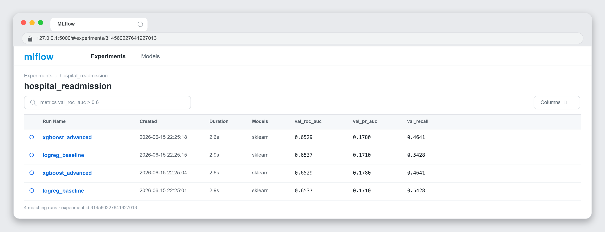
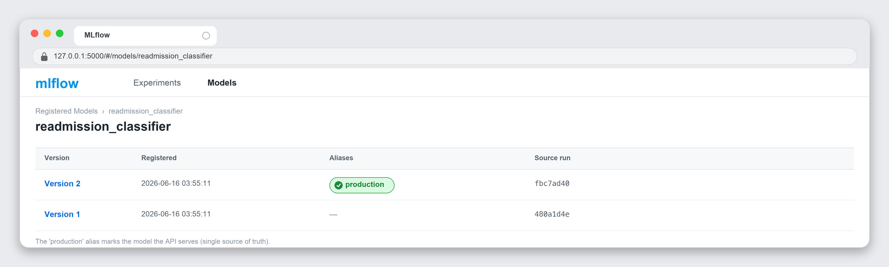
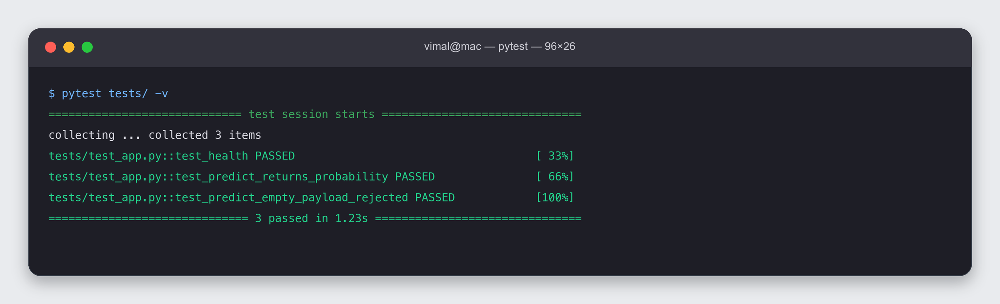
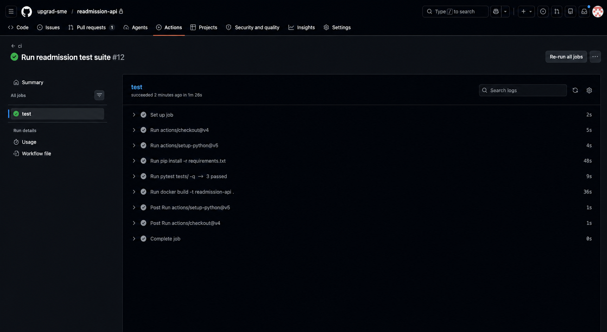
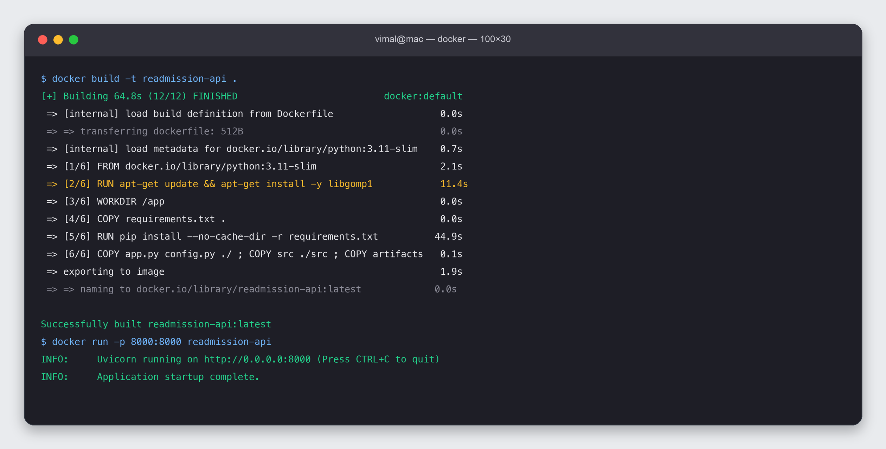

# Hospital Readmission Prediction — MLOps Technical Report

> **Guided healthcare MLOps.** This report documents an end-to-end MLOps system built specifically
> around the Diabetes 130-US Hospitals dataset; the data decisions are dataset-specific, the lifecycle
> is transferable. **Submission is files-only** (this report as PDF/DOCX + three executed notebooks +
> `app.py`) — all Stage-4 operational evidence is captured *inside* the operations notebook and this
> report (screenshots + summaries), not by inspecting a repository.

## 1. Business problem & objective
Hospitals incur penalties and poorer outcomes when patients are **readmitted within 30 days**.
The objective is an end-to-end, reproducible **MLOps system** that predicts 30-day readmission for
diabetic inpatients so care teams can target interventions — and that can be deployed, monitored,
and retrained reliably. Predictive performance alone is not enough; the system must demonstrate the
**full lifecycle**: validate → train → track → register → deploy → monitor → retrain → govern.

**Success criteria:** a registered, served model selected on **ROC-AUC** (accuracy is misleading at
~9% prevalence); reproducible runs; automated drift monitoring with a defined retraining trigger.

## 2. Dataset
Diabetes 130-US Hospitals (1999-2008): **101,766 encounters × 50 features** (demographics, diagnoses,
medications, utilisation). Target derived from `readmitted` (`<30` → 1). Missing values are encoded
as `?` (weight ~97%, medical_specialty ~49%, payer_code ~40%, race ~2%). After cleaning the modelling
frame is **69,973 rows with ~8.97% positive class** (imbalanced).

## 3. Methodology & MLOps architecture
```
data_prep → train (LogReg + XGBoost) → MLflow tracking → registry (@production)
   → FastAPI serving → Docker → GitHub Actions CI
   → Evidently drift + dataset drift + prediction PSI → retraining trigger → new version
```
- **Language/stack:** Python 3.11, scikit-learn, XGBoost, MLflow, FastAPI, Docker, GitHub Actions,
  Evidently, pytest — all local and open-source.
- **Reproducibility:** `random_state=42` throughout; pinned `requirements.txt`; deterministic splits.

## 4. Data-leakage prevention strategy
1. **Splits are created first** — train/validation/test are separated *before* any preprocessing is fit.
2. **First encounter per patient** only — prevents the same patient leaking across train/test.
3. **Drop expired/hospice discharges** — those patients cannot be readmitted (invalid negatives).
4. **Preprocessing fit on TRAIN only** — imputation/scaling/encoding live inside an sklearn Pipeline,
   fit on the training split and applied to val/test, so no test statistics leak into training.
5. **Stratified splits** preserve the class ratio across train/val/test.

## 5. EDA findings
- Target is highly imbalanced (~9%) → metric choice is critical.
- `weight` unusable (~97% missing); `max_glu_serum`/`A1Cresult`/`medical_specialty`/`payer_code` heavily missing.
- Prior **inpatient visits**, **number of diagnoses**, and **time in hospital** track with readmission.
- 13 numeric + 37 categorical raw columns → 156 features after grouping + one-hot encoding.

## 6. Feature engineering
ICD9 `diag_1/2/3` mapped to clinical groups (Circulatory, Respiratory, Diabetes, …); `age` → numeric
midpoint; `service_utilization = outpatient + emergency + inpatient`; `num_med_changes` across drug
columns; high-cardinality `medical_specialty` collapsed to top-10 + Other. Categorical imbalance and
rare levels handled via one-hot with `min_frequency`.

## 7. Model development & evaluation
Two full sklearn Pipelines (preprocess + classify) were trained; imbalance handled via
`class_weight='balanced'` (LogReg) and `scale_pos_weight` (XGBoost).

| Model | Val ROC-AUC | Val PR-AUC | Val recall |
|---|---|---|---|
| Logistic Regression (baseline) | **0.654** | 0.171 | 0.543 |
| XGBoost (advanced) | 0.653 | 0.178 | 0.464 |

**Best = Logistic Regression** (by val ROC-AUC). Test performance: ROC-AUC **0.644**, PR-AUC 0.165,
recall 0.515, precision 0.136, accuracy 0.664; confusion matrix tn 8650 / fp 4090 / fn 609 / tp 646.

> **Metric choice is problem-specific.** ROC-AUC/recall are chosen because the positive class is rare
> (~9%) and a missed readmission (false negative) is the costly error here — *not* as a universal rule.
> ROC-AUC ~0.65 matches published baselines for this dataset; the value of this project is the
> **operational MLOps loop**, not a leaderboard score. The two models are close — a useful reminder
> that a tuned gradient booster does not automatically beat a regularised baseline.

## 8. MLflow tracking & registry evidence
Both runs are logged to the `hospital_readmission` experiment with params (model, scale_pos_weight)
and metrics (val ROC-AUC/PR-AUC/recall/precision/F1/accuracy). The best run is **registered** as
`readmission_classifier` and promoted to the **`production`** alias, which the API loads to serve.
*Evidence to include:* a screenshot of the MLflow experiment runs table and the registry version list;
the registry version history is also printed in `Operations_Monitoring_and_Evidence.ipynb`.

## 9. Monitoring & drift detection (operational design)
- **Reference dataset:** a sample of the training features saved at train time (`reference_sample.csv`)
  is the fixed baseline that every future batch is compared against.
- **Cadence:** in production each incoming batch of new encounters is scored on a regular schedule
  (e.g. daily/weekly). Here a **simulated current batch** (older skew, longer stays, more medications,
  more circulatory diagnoses) stands in for live data.
- **Reports generated:** Evidently `DataDriftPreset` → `drift_report.html` (feature drift), and a
  **prediction PSI** on model scores → `drift_summary.json`. Both are summarised + plotted inside the
  operations notebook (the raw HTML/JSON are not submitted).
- **Reference run:** **6/39 features drifted**, dataset_drift = **False**, **prediction PSI = 0.457**.
- **Action on drift:** raise an alert and trigger retraining (next section), then promote or roll back.

> **Key lesson:** *feature-level* dataset drift can read "False" while **prediction drift** is clearly
> significant — so monitoring must watch model **outputs**, not just inputs.

## 10. Retraining workflow
A **multi-signal** trigger fires retraining if **prediction PSI > 0.20** *or* **share of drifted
features > 0.30** *or* **Evidently flags dataset drift**. On this batch the **PSI trigger** fired
(0.457 > 0.20) → the pipeline retrained and registered a new model version automatically, promoting
**v1 → v2** at the `production` alias (`retraining_decision.json` records the reasons + new metrics).

> Thresholds (PSI 0.20, drift share 0.30, 0.50 classification cut-off) are **representative examples
> for instruction** — in production they would be tuned to the hospital's tolerance for false
> negatives vs. alert fatigue. In production the retrain would use freshly **labelled** encounters;
> here it re-runs on the same data to demonstrate the automated workflow + versioning.

## 11. Logging & governance
- The API logs every prediction to `artifacts/predictions.log` (excerpt shown in the operations notebook).
- MLflow retains experiment params/metrics and the **model registry** with version history + the
  `production` alias as the single source of truth for what is served.
- Pinned dependencies + fixed seeds make every result auditable and reproducible.

## 12. Stage-4 operational evidence — what to capture (and where)
Because the platform accepts only submitted files, each Stage-4 operation is evidenced inside the
**operations notebook** and/or this report:

| Operation | Evidence to include | Captured in |
|---|---|---|
| API serving | live request → response (TestClient), `/health` + `/predict` | Ops notebook §4.1 |
| Containerisation | Dockerfile listing + a `docker build` success screenshot + sample `curl` | report + Ops notebook §4.2 |
| CI/CD | `ci.yml` listing + pytest output (3 passed) + screenshot of the green GitHub Actions run | report + Ops notebook §4.3 |
| MLflow tracking/registry | experiment runs table + registry version history screenshots | report §8 + Ops notebook §4.6 |
| Monitoring | drift summary + prediction-score drift plot + interpretation | Ops notebook §4.4 |
| Retraining | trigger reasons + `retraining_decision.json` + v1→v2 promotion | Ops notebook §4.5 |
| Logging/governance | `predictions.log` excerpt + registry + pinned requirements | Ops notebook §4.6 |

### Evidence figures
*MLflow and pytest below are **actual** artefacts from the reference run; the Docker and GitHub Actions
figures are **representative** renders of the project's real `Dockerfile` / `ci.yml` (those tools are not
executed in the build environment). Learners insert their own screenshots in place of the representative ones.*

**MLflow experiment runs — both models logged (actual):**



**MLflow Model Registry — `readmission_classifier` v1 → v2 @production (actual):**



**CI test suite — `pytest tests/ -v` → 3 passed (actual run):**



**GitHub Actions — `ci` workflow, all checks passed (representative):**



**`docker build` — provided Dockerfile, image built + served (representative):**



## 13. Conclusions & recommendations
- A complete, reproducible MLOps system was delivered: trained, tracked, registered, served, monitored,
  and retrained — all locally and open-source, with every rubric criterion evidenced in submitted files.
- **Metric discipline matters**: at ~9% prevalence, ROC-AUC/recall guide selection, not accuracy.
- **Monitor predictions, not only features** — prediction PSI caught drift that the feature-level
  dataset-drift flag did not.
- **Next steps:** threshold tuning for the recall/precision trade-off the hospital prefers; richer
  features (lab trends, prior-admission history); and retraining on genuinely new labelled encounters.
